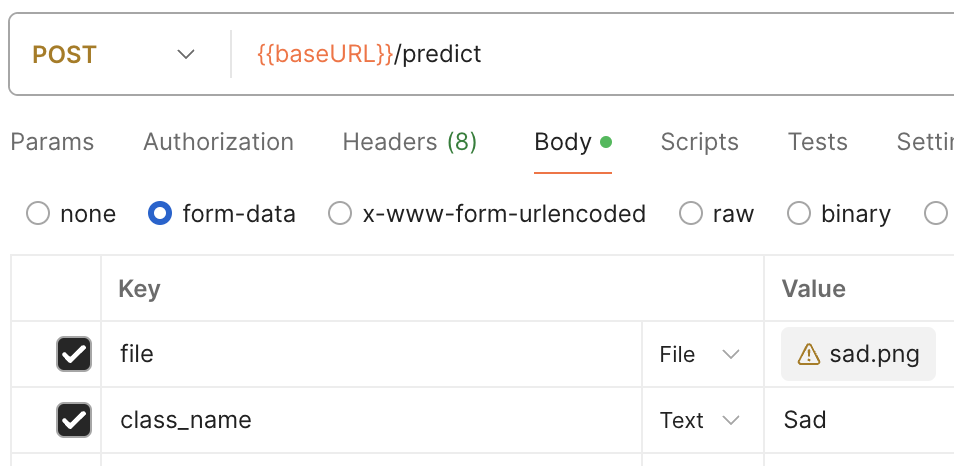
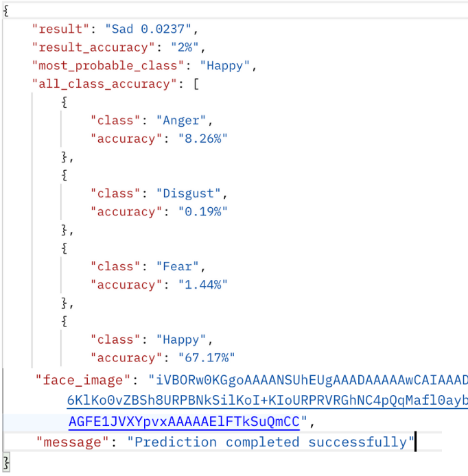

# FER-API
This repository includes a ready-to-use deployable facial emotion recognition model and its API.

Request: 

Response: 

Note: response image is cropped, the full body contains all 7 emotions probability score.

To build using Docker:
`docker build -t fer-api .`

To run using Docker (locally):
`docker run -p 8000:80 fer-api`
